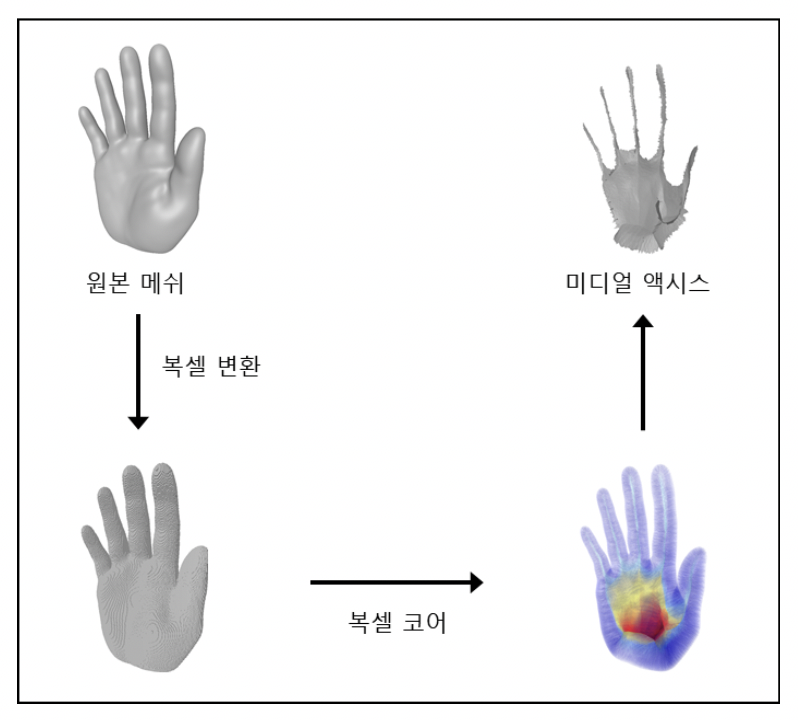

# delta-processor-axis &middot; 

SW스타랩 &lt;3차원 기하 모델 프로세싱 프레임워크 개발&gt; 미디얼 액시스 근사 계산 노드

## 설명

원본 매쉬 혹은 샘플 정점들로부터 [미디얼 액시스](https://en.wikipedia.org/wiki/Medial_axis)를 계산하는 모듈입니다.  
[N. Amenta, S. Choi and R. Kolluri, The Power Crust](http://www.cs.ucdavis.edu/~amenta/powercrust.html) 논문을 기반으로 구현되었습니다.

